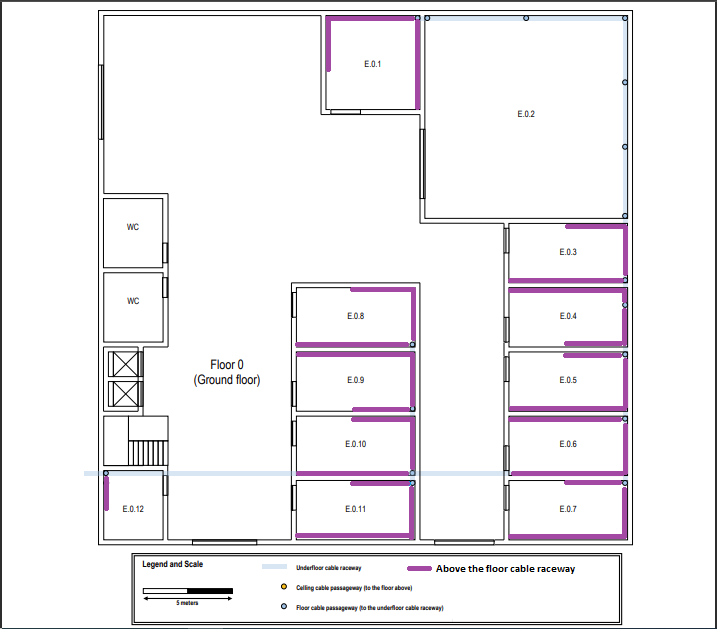

RCOMP 2022-2023 Project - Sprint 1 - Member 1181478 folder
===========================================
(This folder is to be created/edited by the team member 1181478 only)

# Building E

# Building dimensions

Length: 30 meters

Width: 30 meters

Two floors:
1. Floor 0:
    - Underground cable raceway
    - Ceiling height : 4 meters
2. Floor 1:
    - Ceiling height: 3 meters
    - Removable dropped ceiling: 2.5 meters (So there's about 0,5 meters of space, in terms of height, to put cables).

### Number of network outlets

Structured cabling standards specifies a minimum of two outlets per work area,
and also a ratio of two outlets for each 10 square meters of area.

# Building E - Ground floor(floor 0)

## Outlets

- Room E.0.2 has a specific purpose and the only network outlets necessary are two near each floor cable passageway.
- Room E.0.12 no network outlets are required in this room, and the same applies to restrooms and common
  areas like the entrance hall and corridors.

|    Room     | Width (m) | Length (m) | Area(m2)   |     No. Outlets needed((area/10)*2)     | No. Outlets used       |
|:-----------:|:---------:|:----------:|------------|:---------------------------------------:|------------------------|
|    E.0.1    |    5.2    |    5.2     | 27.04      |                   5.4                   | 6                      |
|    E.0.2    |   11.25   |   11.25    | 126.56     |                ---------                | 12(6 cable passageway) |
|    E.0.3    |   3.13    |    6.67    | 20.87      |                   4.2                   | 6                      |
|    E.0.4    |   3.13    |    6.67    | 20.87      |                   4.2                   | 6                      |
|    E.0.5    |   3.13    |    6.67    | 20.87      |                   4.2                   | 6                      |
|    E.0.6    |   3.13    |    6.67    | 20.87      |                   4.2                   | 6                      |
|    E.0.7    |   3.13    |    6.67    | 20.87      |                   4.2                   | 6                      |
|    E.0.8    |   3.13    |    6.67    | 20.87      |                   4.2                   | 6                      |
|    E.0.9    |   3.13    |    6.67    | 20.87      |                   4.2                   | 6                      |
|   E.0.10    |   3.13    |    6.67    | 20.87      |                   4.2                   | 6                      |
|   E.0.11    |   3.13    |    6.67    | 20.87      |                   4.2                   | 6                      |
|   E.0.12    |   3.13    |    3.96    | 12.39      |                ---------                | ---------              |
| AccessPoint | --------- | ---------  | ---------  |                ---------                | 2                      |

#### Note1: All the measurements were made based on paper and the scale of 5 meters given(corresponding to 2.4 cm).
#### Note2: The double outlets used for the access point are not represented in this floor plan.

#### Total number of outlets = 74 (we used double outlets so 37 double outlets)

## Extra cable raceways 

Despite we have a cable raceway that goes under the floor , we have two options,first is use 
"floor cable passageway(to the underfloor cable raceway)"
that is marked in the above picture and after that use cable raceways inside each room but above floor,
or the second one is drill a hole in the floor in each point were we have an outlet that has underfloor cable 
raceway passageway and extend a cable raceways from the outlet to the floor(on those that's possible), the others 
will have an extended cable raceway.

To make a more simple solution I decided that I won't drill new holes in the floor, so
I use "floor cable passageway(to the underfloor cable raceway)" go up 1m and go around the room
until each outlet, because the underfloor cable raceway didn't go to all outlets and in this way 
I don't have a mix solution.

The only exception to this the solution above its room E.0.2 because according to the project description
"Rooms E.0.2 has a specific purpose and the only network outlets necessary are two near each floor cable passageway",
so in this case I go up 1m with cable raceway in each double outlet.

#### Important aspects(Consulting TP-01 available on moodle):

- Room E.0.12  is the telecommunications room, which means intermediate cross connect(IC) will be placed there and there is no need for outlets here.

- The outlets were organized so that is possible to connect a PC with a 5 meter or less cable from any reasonable position on the room, using long patch cords. 
  Wherever the user equipment is, there should always be an outlet less than three meters away.(Places near doors were ignored since it's not practical to have an outlet behind a door).

- The 2 outlets per 10m2 rule was respect, in all rooms extra outlets were put to cover for an unexpected number of workers in a room.

- A double outlet was put near the access point for an easier fix in case the used cable gets damaged.

- A wireless 802.11 local area coverage is used, the access-point device will grant approximately a 50 meters diameter circle coverage.

- Between IC and MC, it is needed the use of fiber since the distance between this is higher than the maximum 90m of the cooper cables.

- For the access point it is needed to drill a hole between Room E.0.8 and the hall.

- The router channel is the following(access point), channel 1, although it was told to us that the access point disperse is signal 
   in a donut shape and its signal in vertical usually goes around 3 and at most 3.5 meters and looking at the 
   measurements of each floor we probably didn't need to use channels , but in project description nothing was
    told about the materials of the construction so to just be safe and make sure that the different access points
    in the different floors don't interfere with each other we will use channels.

- The longest cooper cable on this floor is around 81 meters long,
    this only happen for 1 double outlet,not sufficiently close to the maximum 90 meter for this type of cable.

- The copper cables used were CAT6A and the fiber cables were 4 pair monomodo fiber. More information on these on the planing.md.

- The intermediate cross connect will use a 19" rack format, housing :
    
  - A patch panel with 12 ports with 1U size and a switch with 12 ports with 1U size.
    It is to note that the switch used has fiber ports to connect to the main cross connect.
  - A patch panel with 12 ports with 1U size and a switch with 12 ports with 1U size.
    Between IC(floor 0) and HC(floor 1) , copper cables will be used, since there isn't more than 90m of cable necessary between those two.
    In this connection, 4 cables were used for security.
  - 2 patch panel with 48 ports with 1U size and 2 switch with 48 ports with 1U size, for outlets.   

## Intermediate cross connect(IC) layout

|                                               | U size |   Justification   |
|:---------------------------------------------:|:------:|:-----------------:|
| Management Horizontal Cable Rack("passafios") |   1    |         -         |
|             Patch panel 12 ports              |   1    | MC->IC connection |
| Management Horizontal Cable Rack("passafios") |   1    |         -         |
|             Patch panel 12 ports              |   1    | IC->HC connection |
| Management Horizontal Cable Rack("passafios") |   1    |         -         |
|             Patch panel 48 ports              |   1    |      Outlets      |
| Management Horizontal Cable Rack("passafios") |   1    |         -         |
|             Patch panel 48 ports              |   1    |      Outlets      |
| Management Horizontal Cable Rack("passafios") |   1    |         -         |
|                Switch 12 ports                |   1    | MC->IC connection |
| Management Horizontal Cable Rack("passafios") |   1    |         -         |
|                Switch 12 ports                |   1    | IC->HC connection |
| Management Horizontal Cable Rack("passafios") |   1    |         -         |
|                Switch 48 ports                |   1    |      Outlets      |
| Management Horizontal Cable Rack("passafios") |   1    |         -         |
|                Switch 48 ports                |   1    |      Outlets      |
|                     Total                     |   16   |         -         |

- For feature improvements we should leave at least around 50% free space on our cabinet,
    so a 48U cabinets will be used.

## Inventory For Ground floor(floor 0)

|          Material           | Quantity | Price (€) |
|:---------------------------:|:--------:|:---------:|
|        Cabinets 48U         |    1     |  2029.55  |
|       Double outlets        |    37    |   418.1   |
|    Patch Panel 48 Ports     |    2     |    138    |
|       Switch 48 Ports       |    2     |  1323.54  |
|    Patch Panel 12 Ports     |    1     |   61.92   | 
|       Switch 12 Ports       |    1     |  254.95   |
| Patch Panel 12 Ports(Fiber) |    1     |           | 
|   Switch 12 Ports(Fiber)    |    1     |           |
|        Copper Cables        | 3222.5m  |  2674.68  | 
|        Fibre Cables         |   2.5m   |           |
|       Cable Raceways        |  165.6m  |  2470.8   |
|        Access Points        |    1     |   80.36   |
|        Total floor 0        |    -     |           |

# Building E - First floor(floor 1)

## Outlets

- Rooms E.1.19 and E.1.20 are storage areas that may be used to house a cross-connect and other network
  infrastructure hardware, no network outlets are required there, the same goes for restrooms, and common
  areas like halls and corridors.

|    Room     | Width (m) | Length (m) |  Area(m2)   | No. Outlets needed((area/10)*2) |  No. Outlets used  |
|:-----------:|:---------:|:----------:|:-----------:|:-------------------------------:|:------------------:|
|    E.1.1    |   7.14    |     10     |    71.4     |              14.28              |         16         |
|    E.1.2    |   3.81    |    6.19    |    23.58    |              4.72               |         6          |
|    E.1.3    |   3.81    |    6.19    |    23.58    |              4.72               |         6          |
|    E.1.4    |   4.52    |    9.52    |     43      |               8.6               |         10         |
|    E.1.5    |   3.81    |    6.67    |    25.41    |               5.1               |         6          |
|    E.1.6    |   3.81    |    6.67    |    25.41    |               5.1               |         6          |
|    E.1.7    |   3.81    |    6.67    |    25.41    |               5.1               |         6          |
|    E.1.8    |   3.81    |    6.67    |    25.41    |               5.1               |         6          |
|    E.1.9    |   3.81    |    6.67    |    25.41    |               5.1               |         6          |
|   E.1.10    |   3.81    |    6.67    |    25.41    |               5.1               |         6          |
|   E.1.11    |   3.81    |    6.19    |    23.58    |              4.72               |         6          |
|   E.1.12    |   3.81    |    6.19    |    23.58    |              4.72               |         6          |
|   E.1.13    |   3.81    |    5.71    |    21.76    |              4.35               |         6          |
|   E.1.14    |   3.81    |    5.71    |    21.76    |              4.35               |         6          |
|   E.1.15    |   3.81    |    5.71    |    21.76    |              4.35               |         6          |
|   E.1.16    |   3.81    |    5.71    |    21.76    |              4.35               |         6          |
|   E.1.17    |   3.81    |    5.71    |    21.76    |              4.35               |         6          |
|   E.1.18    |   3.81    |    5.71    |    21.76    |              4.35               |         6          |
|   E.1.19    |   1.90    |    3.33    |    6.34     |            ---------            |     ---------      |
|   E.1.20    |   1.67    |    6.43    |    10.74    |            ---------            |     ---------      |
| AccessPoint | --------- | ---------  |  ---------  |            ---------            |         2          |

#### Note1: All the measurements were made based on paper and the scale of 5 meters given(corresponding to 2.1 cm).
#### Note2: The double outlets used for the access point are not represented in this floor plan.

#### Total number of outlets = 124(we used double outlets so 62 double outlets)

#### Important aspects(Consulting TP-01 available on moodle):

- Copper cable distance has in account the fact that every cable raceway has to drop from the ceiling to 1 meter of height at least,
    which means there's 1,5m of added copper cable on rooms from E.1.1 until E.1.18.

- Room E.1.19 the copper cable comes through the floor cable passageway to the floor below and goes until the celling and after goes to a corner of the room,
    to pass from there to room E.1.20. Room E.1.20 will be telecommunications room which means the horizontal cross connect will be placed there
      and there is no need for outlets here. Between Floors, the IC connects to the HC in floor above through the ceiling passageway.

- It's important to note that all the cabling done on floor one is above the droppable ceiling and below the actual ceiling,
   and whenever the cables need to drop from the ceiling, a cable raceway is used.

- Access point in this floor will be placed on the main hall, between Room E.1.12 and E.1.13. A hole need's to be drill in the droppable celling to
  place the access point there.- A double outlet was put near the access point for an easier fix in case the used cable gets damaged.

- The router channel is the following(access point), channel 6. Justification for this choice is above in floor 0.

- The rules for the positioning of the outlets and access points are the same as the ones on the floor 0.
      The cooper cables used were the same and there was no need for fiber cables in this floor.

- The longest cooper cable on this floor is around 86 meters long, close to the maximum 90 meter for this type of cable.

- The horizontal cross connect will use a 19" rack format, housing :

    - A patch panel with 12 ports with 1U size and a switch with 12 ports with 1U size.
      Between IC(floor 0) and HC(floor 1) , copper cables will be used, since there isn't more than 90m of cable necessary between those two.
      In this connection, 4 cables were used for security.
    - 3 patch panel with 48 ports with 1U size and 3 switch with 48 ports with 1U size, for outlets.

## Horizontal cross connect(HC) layout

|                                               | U size |   Justification   |
|:---------------------------------------------:|:------:|:-----------------:|
| Management Horizontal Cable Rack("passafios") |   1    |         -         |
|             Patch panel 12 ports              |   1    | IC->HC connection |
| Management Horizontal Cable Rack("passafios") |   1    |         -         |
|             Patch panel 48 ports              |   1    |      Outlets      |
| Management Horizontal Cable Rack("passafios") |   1    |         -         |
|             Patch panel 48 ports              |   1    |      Outlets      |
| Management Horizontal Cable Rack("passafios") |   1    |         -         |
|             Patch panel 48 ports              |   1    |      Outlets      |
| Management Horizontal Cable Rack("passafios") |   1    |         -         |
|                Switch 12 ports                |   1    | IC->HC connection |
| Management Horizontal Cable Rack("passafios") |   1    |         -         |
|                Switch 48 ports                |   1    |      Outlets      |
| Management Horizontal Cable Rack("passafios") |   1    |         -         |
|                Switch 48 ports                |   1    |      Outlets      |
| Management Horizontal Cable Rack("passafios") |   1    |         -         |
|                Switch 48 ports                |   1    |      Outlets      |
|                     Total                     |   16   |         -         |

- For feature improvements we should leave at least around 50% free space on our cabinet,
  so a 48U cabinets will be used.

## Inventory For First floor(floor 1)

|       Material       | Quantity | Price (€) |
|:--------------------:|:--------:|:---------:|
|     Cabinets 48U     |    1     |  2029.55  |
|    Double outlets    |    62    |   700.6   |
| Patch Panel 48 Ports |    3     |    207    |
|   Switch 48 Ports    |    3     |  1985.31  |
| Patch Panel 12 Ports |    1     |   61.92   |
|   Switch 12 Ports    |    1     |  254.95   |
|    Copper Cables     | 6722.3m  |  5579.50  | 
|    Cable Raceways    |    m     |           |
|    Access Points     |    1     |   80.36   |
|    Total floor 0     |    -     |           |

 
# Total Inventory

|       Material       | Quantity |
|:--------------------:|:--------:|
| Patch Panel 48 Ports |          |
| Patch Panel 24 Ports |          |
| Patch Panel 12 Ports |          |
|   Switch 48 Ports    |          |
|   Switch 24 Ports    |          |
|   Switch 12 Ports    |          |
|    Cable Raceways    |    m     |
|     Fibre Cables     |    m     |
|    Copper Cables     |    m     |
|    Access Points     |    2     |
|     Connectors*      |          | 

**Total Cost Of Building E : €**