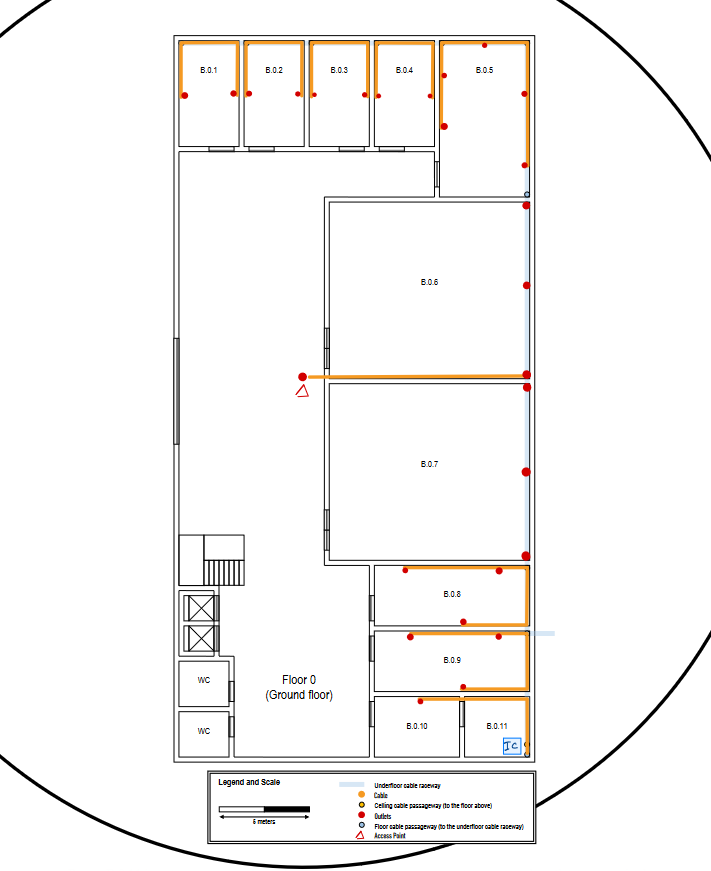
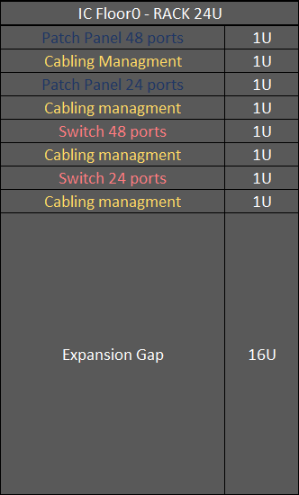
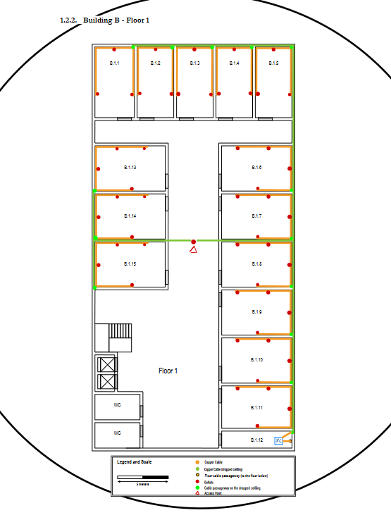
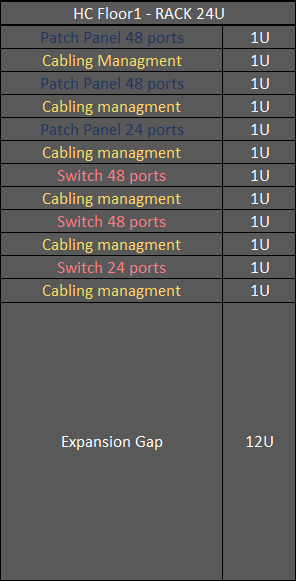

RCOMP 2022-2023 Project - Sprint 1 - Member 1210951 folder
===========================================

# Overview

## Floor 0:
- Underground cable raceway
- Ceiling height : 4 meters
- B.0.11 does not need outlets
- B.0.6 and B.0.7 only need 5 outlets along the underfloor cable raceway
## Floor 1:
- Ceiling height: 3 meters
- Removable dropped ceiling: 2.5 meters

## Common to both floors:
- Full Wi-Fi coverage
- No network outlets required at the restrooms, halls, and corridors
- Rooms with no specific requirements regarding outlets must follow the ratio of 2 outlets by 10m2

# Ground floor - Floor 0
## Measurements

|      Room       | Length (m) | Width (m) | Area (m²) | Outlets |
| :-------------: | :--------: | :-------: | :-------: | :-----: |
| B.0.1 to B.0.4  |    5.77    |   3.27    |   18.87   |    4    |
|      B.05       |    8.65    |   5       |   43.25   |   10    |
| B.0.6 and B.0.7 |   10.96    |   9.62    |   105.43  |   5    |
| B.0.8 and B.0.9 |    8.65    |   3.27    |   27.66   |    6    |
|     B.0.10      |    4.62    |   3.27    |   7.85    |    2    |
|     B.0.11      |    3.65    |   3,27    |   11.94   |    0    |
|      TOTAL      |   ------   |  ------   |   377.04  |   50    |

## Network cable/devices layout

- B.0.11 it is used to house the IC, and no outlets are required.

- All the cables run trought the underfloor cable raceway, at the properly passageway all cables are set at 1m from the floor, after that the cables run trougth cable raceways in each room.

- It was placed only 1 Acess Point (AP) on this floor, considering 25m of radius,it is enough to cover all the floor, the AP it is not centered in the floor since it would be inside a room was choosen instead to move it a little bit to the side and place it on the hall with the goal to minimize signal loss, it was also placed a double outlet close to the AP.

## Inventory

### IC

- The IC will be a 24U rack cabinet. In order to provide space for future upgrades in the network infrastucture the rack used needs to be of 24U providing space for 50% additional equipment. The rack cabinet layout will be as follows:

- Considering 0,5m of patch cords to connect each patch panel entry to the switch, we have a total of an additional 36m of cables to interconnect the switches with the patch panels

|        Material        | Price (€) |
| :--------------------: | :-------: |
|     1 Cabinet 24 U      |  799,83   |
| 1 Patch Panel 48 Ports |  69,00   |
|   1 Switch 48 Ports    |  661,77 |
| 1 Patch Panel 24 Ports |   27,50   |
|   1 Switch 24 Ports    |  314,97  |
| 4 Management Horizontal Cable Rack|  79,96    |
| 36m Copper Cables |    29,88    |

- Connectors RJ45:
    - We need 27 double outlets, and for each 4 connectors (108)
    - For each patch panel entry we need another 2 (72)
    - 2 more to connect our AP (2)

### Floor 0 

|        Material        | Price (€) |
| :--------------------: | :-------: |
|   27 Double outlets    |  305,10 |
| 115m of Cable Raceways | 1715,80   |
| 2000m of Copper Cables |  166,00  |
|    1 Access Point     |   80,36   |
|     1 Cabinet 24 U      |  799,83   |
| 1 Patch Panel 48 Ports |  69,00   |
| 1 Patch Panel 24 Ports |   27,50  |
|   1 Switch 48 Ports    |  661,77 |
|   1 Switch 24 Ports    |  944,91   |
|  8 m of Fiber Cables  |   22,96    |
|  200 Connectors(RJ45)   |    40,00  |
| 4 Management Horizontal Cable Rack|  79,96  |
|  TOTAL      |   4833,23    |

# Floor 1
## Measurements

|      Room       | Length (m) | Width (m) | Area (m²) | Outlets(each room) |
| :-------------: | :--------: | :-------: | :-------: | :-----: |
| B.1.1           |    6.85    |   3.70    |   25.35   |    6    |
| B.1.2 to B.1.5           |    6.85    |   3.52    |   24.11   |    6    |
|B.1.6 to B.1.11 and B.1.13 to B.1.15|    6.85    |   3.52       |  30.4   |    8    |
| B.1.11 |  6.85    |   1.67    |  11.44   |   0    |
|      TOTAL      |   ------   |  ------   |     406.79   |   102    |

## Network cable/devices layout

- Similiar to the room B.0.11 the room B.1.12 does not need outlets and it will be used to store the HC

- The connection between the HC on this floor and the IC on the floor 0 was made with 4 cables, 5m each(since the floor 0 is 4m tall), in order to minimize possible future problems connecting both equipments properly 

- In this floor there is a dropped ceilig at a 2,5 heigth, so all the cable drop 1,5m at the correspondent ceiling passageway and after that each cable runs trougth the cable raceways properly installed in each room

- Following the same idea with the floor 0 it was placed only 1 Acess Point (AP) on this floor, considering 25m of radius,it is enough to cover all the floor, and close to it a double outlet

## Inventory 

- Considering 0,5m of patch cords to connect each patch panel entry to the switch, we have a total of an additional 60m of cables to interconnect the switches with the patch panels

- Connectors RJ45:
    - We need 52 double outlets, and for each 4 connectors (208)
    - For each patch panel entry we need another 2 (240)
    - 2 more to connect our AP (2)

### HC

1|        Material        | Price (€) |
| :--------------------: | :-------: |
|     1 Cabinet 24 U      |  799,83   |
| 2 Patch Panel 48 Ports |  138,00   |
|   2 Switch 48 Ports    |  1323,54  |
| 1 Patch Panel 24 Ports |   27,50   |
|   1 Switch 24 Ports    |  314,97  |
| 6 Management Horizontal Cable Rack|  119,94    |
| 36m Copper Cables |    29,88    |

### Floor 1
|        Material        | Price (€) |
| :--------------------: | :-------: |
| 3610m of Copper Cables |  2996.30  |
| 150m of Cable Raceways |  2238.00  |
|  450 Connectors(RJ45)   |    90,00     |
|   52 Double outlets    |  587,60   |
|    1 Access Point     |   80,36   |
|     1 Cabinet 24 U      |  799,83   |
| 2 Patch Panel 48 Ports |  138,00   |
|   2 Switch 48 Ports    |  1323,54  |
| 1 Patch Panel 24 Ports |   27,50   |
|   1 Switch 24 Ports    |  314,97  |
| 6 Management Horizontal Cable Rack|  119,94    |
|  TOTAL      |   8716,04     |

# Total Inventory

**Total Cost Of Building B : 13549,27**

