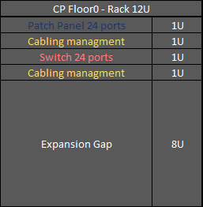

RCOMP 2022-2023 Project - Sprint 1 - Member 1210951 folder
===========================================

# Floor 0
## Measurements

|      Room       | Length (m) | Width (m) | Area (m²) | Outlets |
| :-------------: | :--------: | :-------: | :-------: | :-----: |
| B.0.1 to B.0.4  |    5.77    |   3.27    |   18.87   |    4    |
|      B.05       |    8.65    |   5       |   43.25   |   10    |
| B.0.6 and B.0.7 |   10.96    |   9.62    |   105.43  |   22+1(cp)    |
| B.0.8 and B.0.9 |    8.65    |   3.27    |   27.66   |    6    |
|     B.0.10      |    4.62    |   3.27    |   7.85    |    2    |
|     B.0.11      |    3.65    |   3,27    |   11.94   |    0    |
|      TOTAL      |   ------   |  ------   |   377.04  |   84    |

## Network cable/devices layout

## Inventory

### IC

|        Material        | Price (€) |
| :--------------------: | :-------: |
|     1 Cabinet 24 U      |  799,83   |
| 1 Patch Panel 48 Ports |  69,00   |
|   1 Switch 48 Ports    |  661,77 |
| 1 Patch Panel 24 Ports |   27,50   |
|   1 Switch 24 Ports    |  314,97  |
| 4 Management Horizontal Cable Rack|  79,96    |

### CP

|        Material        | Price (€) |
| :--------------------: | :-------: |
|     2 Cabinet 12U      |  1046,6   |
| 2 Patch Panel 24 Ports |   55,00   |
|   2 Switch 24 Ports    |  629,94   |
| 4 Management Horizontal Cable Rack|  79,96    |

### Floor 0 

|        Material        | Price (€) |
| :--------------------: | :-------: |
|   45 Double outlets    |  508.50   |
| 165m of Cable Raceways | 2461,80   |
| 2100m of Copper Cables |  1743,00  |
|    1 Access Point     |   80,36   |
|     2 Cabinet 12U      |  1046,6   |
|     1 Cabinet 24 U      |  799,83   |
| 1 Patch Panel 48 Ports |  69,00   |
| 3 Patch Panel 24 Ports |   82,50   |
|   1 Switch 48 Ports    |  661,77 |
|   3 Switch 24 Ports    |  944,91   |
|  2 m of Fiber Cables  |   5.74    |
|  182 Connectors(RJ45)   |    36,40     |
|  TOTAL      |   --    |

# Floor 1
## Measurements

|      Room       | Length (m) | Width (m) | Area (m²) | Outlets(each room) |
| :-------------: | :--------: | :-------: | :-------: | :-----: |
| B.1.1           |    6.85    |   3.70    |   25.35   |    6    |
| B.1.2 to B.1.5           |    6.85    |   3.52    |   24.11   |    6    |
|B.1.6 to B.1.11 and B.1.13 to B.1.15|    6.85    |   3.52       |  30.4   |    8    |
| B.1.11 |  6.85    |   1.67    |  11.44   |   0    |
|      TOTAL      |   ------   |  ------   |     406.79   |   102    |

## Network cable/devices layout

## Inventory 
### HC

1|        Material        | Price (€) |
| :--------------------: | :-------: |
|     1 Cabinet 24 U      |  799,83   |
| 2 Patch Panel 48 Ports |  138,00   |
|   2 Switch 48 Ports    |  1323,54  |
| 1 Patch Panel 24 Ports |   27,50   |
|   1 Switch 24 Ports    |  314,97  |
| 6 Management Horizontal Cable Rack|  119,94    |

## Inventory 
### Floor 1
|        Material        | Price (€) |
| :--------------------: | :-------: |
| 3610m of Copper Cables |  2996.30  |
| 150m of Cable Raceways |  2238.00  |
|  208 Connectors(RJ45)   |    41.6     |
|   52 Double outlets    |  587.6   |
|    1 Access Point     |   80,36   |
|     1 Cabinet 24 U      |  799,83   |
| 2 Patch Panel 48 Ports |  138,00   |
|   2 Switch 48 Ports    |  1323,54  |
| 1 Patch Panel 24 Ports |   27,50   |
|   1 Switch 24 Ports    |  314,97  |
| 6 Management Horizontal Cable Rack|  119,94    |
|  TOTAL      |   14077,27     |

# Total Inventory

CAT6
|        Material        | Price (€) |
| :--------------------: | :-------: |
| 5710m of Copper Cables |  4739,3   |
| 315m of Cable Raceways |  4699,8  |
|    2 Access Point     |   80,36   |
|     2 Cabinet 12U      |  1046,6   |
|     2 Cabinet 24 U      |  799,83   |
| 3 Patch Panel 48 Ports |  69,00   |
| 4 Patch Panel 24 Ports |   82,50   |
|   3 Switch 48 Ports    |  661,77 |
|   4 Switch 24 Ports    |  944,91   |
|   97 Double outlets    |  587,6   |
| 14 Management Horizontal Cable Rack|  279,86    |
|  400 Connectors(RJ45)   |    80,00     |
|  2 m of Fiber Cables  |   5.74    |
|  TOTAL      |   14077,27     |

CAT7 
|        Material        | Price (€) |
| :--------------------: | :-------: |
| 5710m of Copper Cables |  4739,3   |
| 315m of Cable Raceways |  4699,8  |
|    2 Access Point     |   80,36   |
|     2 Cabinet 12U      |  1046,6   |
|     2 Cabinet 24 U      |  799,83   |
| 3 Patch Panel 48 Ports |  69,00   |
| 4 Patch Panel 24 Ports |   82,50   |
|   3 Switch 48 Ports    |  661,77 |
|   4 Switch 24 Ports    |  944,91   |
|   97 Double outlets    |  587,6   |
| 14 Management Horizontal Cable Rack|  279,86    |
|  400 Connectors(RJ45)   |    80,00     |
|  2 m of Fiber Cables  |   5.74    |
|  TOTAL      |   14077,27     |
