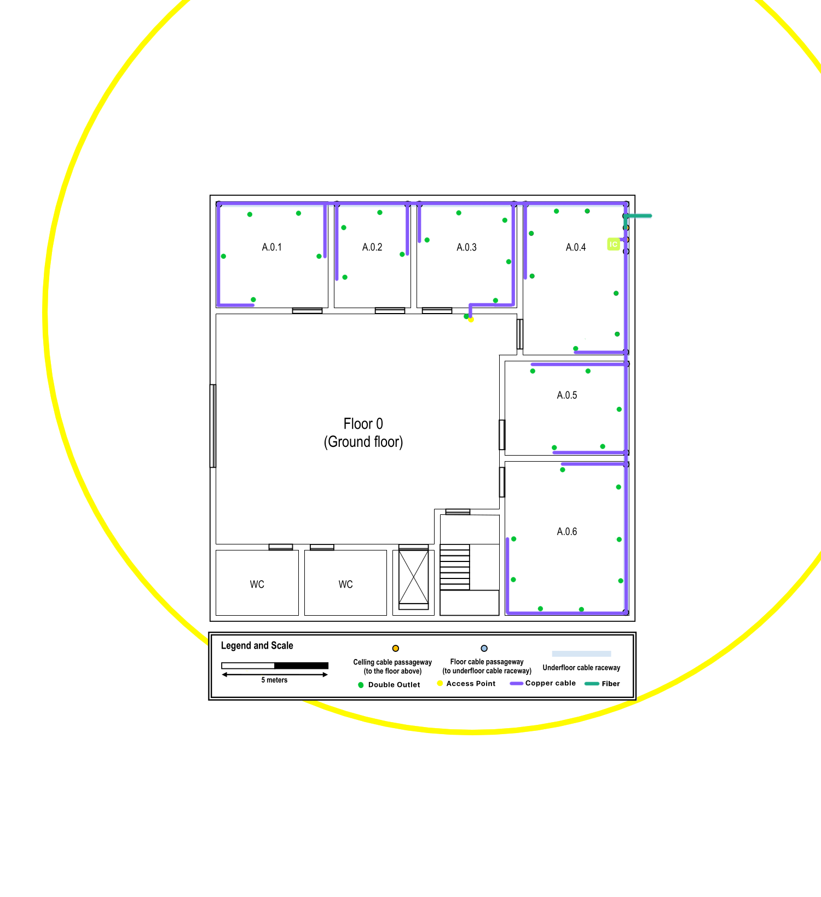
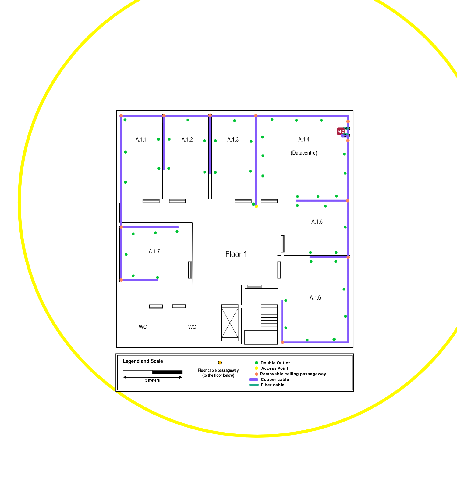

Building A
==========

Building A will hold the datacenter (Room A.1.4), and will also house the main cross-connect
for the structured cabling system.

# Building features

Dimensions: 20 x 20 meters

Two floors:
1. Floor 0:
    - Underground cable raceway
    - Ceiling height: 4 meters
2. Floor 1:
    - Dropped ceiling 2.5 meters from the ground
    - Ceiling height: 3 meters (2.5 effective)

# Network outlets per room

Taking into account the standard of 2 network outlets per 10 squared meters,
the number of outlets for each room was computed using [this Haskell source](./Outlets.hs).

The results for each of the floors is displayed in the following tables:

## Floor 0

<!-- TODO: change to the updated (drawn over) picture -->

### Outlets

| Room  | Width (m) | Length (m)    | No. Outlets   |
|:-----:|:---------:|:-------------:|:-------------:|
| A.0.1 | 5.00      | 5.27          | 5             |
| A.0.2 | 3.64      | 5.00          | 4             |
| A.0.3 | 4.73      | 5.00          | 5             |
| A.0.4 | 5.04      | 7.25          | 7             |
| A.0.5 | 4.46      | 5.85          | 5             |
| A.0.6 | 5.85      | 7.23          | 8             |

Total Outlets: 32

## Floor 1

<!-- TODO: change to the updated (drawn over) picture -->

### Outlets

| Room  | Width (m) | Length (m)    | No. Outlets   |
|:-----:|:---------:|:-------------:|:-------------:|
| A.1.1 | 3.62      | 7.21          | 5             |
| A.1.2 | 3.62      | 7.21          | 5             |
| A.1.3 | 3.62      | 7.21          | 5             |
| A.1.4 | 7.21      | 7.79          | 11            |
| A.1.5 | 4.44      | 5.54          | 5             |
| A.1.6 | 5.83      | 7.21          | 8             |
| A.1.7 | 4.71      | 5.85          | 6             |

Total Outlets: 46

