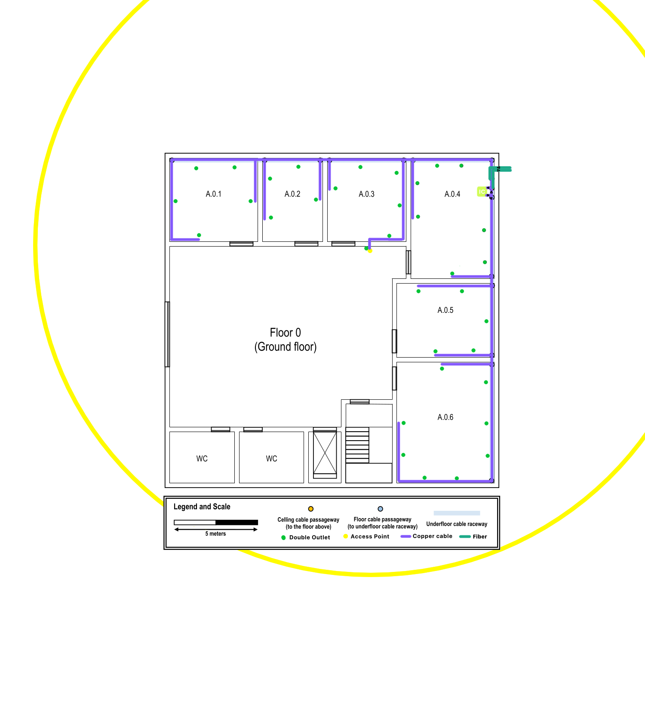

Building A
==========

Building A will hold the datacenter (Room A.1.4), and will also house the main cross-connect
for the structured cabling system.

# Building features

Dimensions: 20 x 20 meters

Two floors:
1. Floor 0:
    - Underground cable raceway
    - Ceiling height: 4 meters
2. Floor 1:
    - Dropped ceiling 2.5 meters from the ground
    - Ceiling height: 3 meters (2.5 effective)

# Network outlets

Taking into account the standard of 2 network outlets per 10 squared meters,
the number of outlets for each room was computed using [this Haskell source](./Outlets.hs).

It was further decided, for convenience of use, that the outlets would stay
1 meter above the floor level.

## Floor 0

A single 25m range (radius) access point was chosen since it is more than enough
to cover the whole floor. In order to connect the AP, a cable will be passed through
a wall in Room A.0.3, which will then extend towards the ceiling and connect to a
double outlet.

Additionally, the AP will reside on the rightmost part of the entrance hall
(i.e. next to rooms A.0.3 and A.0.4) in order to stay closer to areas with a
higher density of people.

In this floor, cables will navigate through an underground raceway and ascend to 1m
above the floor level, so as to connect to the network outlets (located on the walls).

### Outlets

| Room  | Width (m) | Length (m)    | No. Outlets   |
|:-----:|:---------:|:-------------:|:-------------:|
| A.0.1 | 5.00      | 5.27          | 5             |
| A.0.2 | 3.64      | 5.00          | 4             |
| A.0.3 | 4.73      | 5.00          | 5             |
| A.0.4 | 5.04      | 7.25          | 7             |
| A.0.5 | 4.46      | 5.85          | 5             |
| A.0.6 | 5.85      | 7.23          | 8             |

**Total Outlets**: 34 + 1 for access point

## Floor 1

Following the same approach as floor 0, floor 1 will also use a 25m range access point,
located near rooms A.1.3 and A.1.4---opposite to the bottom-right corner of the blueprint
as this is the zone that needs WiFi connection the least.

In this floor, cables will navigate in a raceway above the floor and descend to 1m above
the floor level, so as to connect to the network outlets (located on the walls).

### Outlets

| Room  | Width (m) | Length (m)    | No. Outlets   |
|:-----:|:---------:|:-------------:|:-------------:|
| A.1.1 | 3.62      | 7.21          | 5             |
| A.1.2 | 3.62      | 7.21          | 5             |
| A.1.3 | 3.62      | 7.21          | 5             |
| A.1.4 | 7.21      | 7.79          | 11            |
| A.1.5 | 4.44      | 5.54          | 5             |
| A.1.6 | 5.83      | 7.21          | 8             |
| A.1.7 | 4.71      | 5.85          | 6             |

**Total Outlets**: 45 + 1 for access point

# Cross-connects

## Floor 0

Since there was no information on where to place the cross-connect for this floor,
room A.0.4 was chosen since it is right underneath the datacenter (room A.1.4).

As the number of outlets in this floor is *relatively* low, it was decided that a single
IC would suffice, rather than having both an IC and an HC.

The IC will use a 19" rack format, with two 48 port patch panels and one of 24 ports.
The same applies to the switches. Taking into account the cabling layers between each of
the components, a 24U cabinet would be the most appropriate as it leaves half of its maximum
capacity free to use in the event of future upgrades.

### IC Rack outline

| Item                  | U size    |
|:---------------------:|:---------:|
| Cable Management      | 1U        |
| 48 Port Patch Panel   | 1U        |
| Cable Management      | 1U        |
| 48 Port Patch Panel   | 1U        |
| Cable Management      | 1U        |
| 24 Port Patch Panel   | 1U        |
| Cable Management      | 1U        |
| 48 Port Switch        | 1U        |
| Cable Management      | 1U        |
| 48 Port Switch        | 1U        |
| Cable Management      | 1U        |
| 24 Port Switch        | 1U        |
| Cable Management      | 1U        |
| ---Free Space---      | 11U       |

## Floor 1

The main cross-connect (MC) will reside on room A.1.4 as this is the established location for the
datacenter.

Similar to floor 0, this floor will only contain the MC as a cross-connect as there is no need for
neither an IC nor an HC.

As the connection between the MC in this floor and the IC on floor 0 is crucial, four copper cables will
connect the two cross-connects, as a fail-safe mechanism.

Additionally, an **8-core** fiber cable will extend from the MC into the Technical Ditch of the campus, so as to
provide network to the remaining buildings.

### MC Rack outline

| Item                  | U size    |
|:---------------------:|:---------:|
| Cable Management      | 1U        |
| 48 Port Patch Panel   | 1U        |
| Cable Management      | 1U        |
| 48 Port Patch Panel   | 1U        |
| Cable Management      | 1U        |
| 24 Port Patch Panel   | 1U        |
| Cable Management      | 1U        |
| 48 Port Switch        | 1U        |
| Cable Management      | 1U        |
| 48 Port Switch        | 1U        |
| Cable Management      | 1U        |
| 24 Port Switch        | 1U        |
| Cable Management      | 1U        |
| ---Free Space---      | 11U       |

# Inventory

Two Haskell source files were used to compute the following values:

- [Cable lengths](./Cables.hs)
- [Costs per floor/total](./Items.hs)

## Floor 0

| Item                  | Ammount   | Price (€/per unit)    | Price (€) |
|:----------------------|:---------:|:---------------------:|:---------:|
| Cabinet 24U           | 1         | 799.83€               | 799.83€   |
| Patch Panel 48 ports  | 2         | 69.00€                | 138.00€   |
| Switch 48 ports       | 2         | 661.77€               | 1323.54€  |
| Patch Panel 24 ports  | 1         | 27.50€                | 27.50€    |
| Switch 24 ports       | 1         | 314.97€               | 314.97€   |
| Double Outlets        | 35        | 11.30€                | 395.50€   |
| Access Point          | 1         | 80.36€                | 80.36€    |
| Copper Cable          | 591.65m   | 0.83€                 | 491.07€   |
| Fiber Cable           | 10.52m    | 2.87€                 | 30.19€    |
| Cable Raceways        | 95.53m    | 14.92€                | 1425.31€  |

**Total price**: 5026.27€

## Floor 1

| Item                  | Ammount   | Price (€/per unit)    | Price (€) |
|:----------------------|:---------:|:---------------------:|:---------:|
| 1 Cabinet 24U         | 1         | 799.83€               | 799.83€   |
| 2 Patch Panel 48 ports| 2         | 69.00€                | 138.00€   |
| 2 Switch 48 ports     | 2         | 661.77€               | 1323.54€  |
| 1 Patch Panel 24 ports| 1         | 27.50€                | 27.50€    |
| 1 Switch 24 ports     | 1         | 314.97€               | 314.97€   |
| 46 Double Outlets     | 46        | 11.30€                | 519.80€   |
| 1 Access Point        | 1         | 80.36€                | 80.36€    |
| 978.43m Copper Cable  | 978.43m   | 0.83€                 | 812.10€   |
| 2.96m Fiber cable     | 2.96m     | 2.87€                 | 8.50€     |
| 85.62m Cable Raceways | 85.62m    | 14.92€                | 1277.45€  |

**Total price**: 5302.04€

## Campus

| Item          | Ammount   | Price (€/per unit)    | Price (€) |
|:-------------:|:---------:|:---------------------:|:---------:|
| Fiber cable   | 590.46m   | 2.87€                 | 1694.62€  |

**Total price**: 1694.62€

## Total

**Total Price for Building A:** 12022.93€
