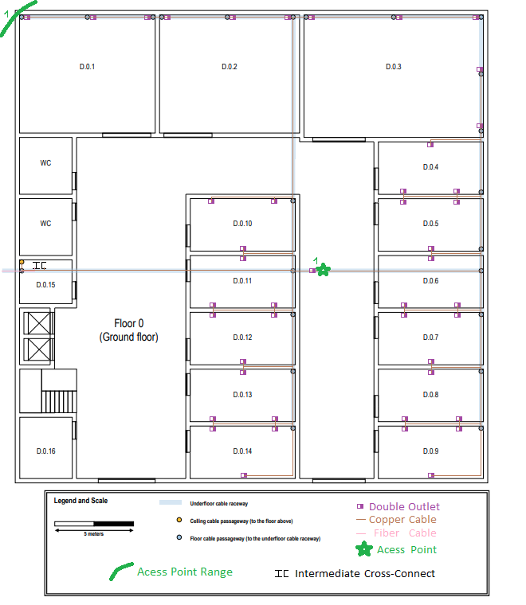
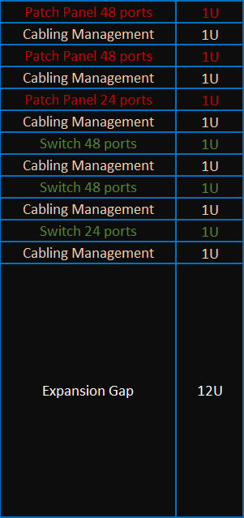

# Building D

## Building Dimensions

**Length:** 30 meters

**Width:** 30 meters

**Height floor zero:** 4 meters

**Height floor one:** 2,5 meters

**Removable dropped ceiling:** 0,5 meters

# Floors

## Floor 0

## Measurements

|      Room       | Length (m) | Width (m) | Area (m²) | Outlets |
| :-------------: | :--------: | :-------: | :-------: | :-----: |
|      D.0.1      |    8,48    |   7,42    |   62,92   |    6    |
|      D.0.2      |    8,79    |   7,42    |   65,22   |    6    |
|      D.0.3      |   11,36    |   7,73    |   87,81   |   10    |
| D.0.4 to D.0.14 |    6,67    |   3,33    |   22,21   |   66    |
|     D.0.15      |    3,33    |   2,73    |   9,09    |    0    |
|     D.0.16      |    3,33    |   3,79    |   11,09   |    0    |
|      TOTAL      |   ------   |  ------   |  258,34   |   88    |

## Information

- As presented in the description document no outlets were placed in rooms D.0.15, D.0.16, and in the common areas.

- It was chosen to place 1 Acess Point (AP) on this floor, with that and the range of 50m diameter, it was possible to cover the entire floor. The AP has also been placed on the right side of the building to be closer to the rooms that may have a bigger density of people.

- For the AP, a cable goes from the ground to the wall and then to the ceiling, then connects to a double outlet that has the purpose of serving the AP.

- The IC will be a 24U rack cabinet with two patch panels of 48 ports and another one with 24 ports. The same applies to the switches, two of 48 ports and another one of 24 ports. It is also required 1U of space between, for instance, each patch panel or switch. The rack used needs to be one of 24U because with this approach it is possible to have the required 50% additional free space for, if needed, future upgrades.

## IC Disposition

## Inventory For Floor 0

|        Material        | Price (€) |
| :--------------------: | :-------: |
|     1 Cabinet 24U      |  799,83   |
|   45 Double outlets    |   508,5   |
| 2 Patch Panel 48 Ports |  138,00   |
|   2 Switch 48 Ports    |  1323,54  |
| 1 Patch Panel 24 Ports |   27,50   |
|   1 Switch 24 Ports    |  314,97   |
| 1662m of Copper Cables |  1379,46  |
|  1,5m of Fibre Cables  |   1,73    |
| 90m of Cable Raceways  |  1342,80  |
|     1 Access Point     |   80,36   |

## Floor 1

## Measurements

|       Room       | Length (m) | Width (m) | Area (m²) | Outlets |
| :--------------: | :--------: | :-------: | :-------: | :-----: |
|      4.1.1       |    6,67    |   4,09    |   27,28   |    8    |
|  4.1.2 to 4.1.7  |    6,67    |   3,33    |   22,21   |   36    |
|      4.1.8       |    3,33    |   2,73    |   9,09    |    0    |
| 4.1.9 to 4.1.12  |    6,67    |   3,33    |   22,21   |   24    |
| 4.1.13 to 4.1.17 |    5,00    |   3,79    |   18,95   |   40    |
|      TOTAL       |   ------   |  ------   |   99,74   |   108   |

## Information

- As presented in the descriptions document no outlets were placed in rooms D.0.15 and D.0.16, and in the common areas.

- Between IC and HC, will be used 4 copper cables because how that connection is critical for the system.

- All cables that have to drop from the droppable ceiling, use a cable raceway.

- The HC will be a 24U rack cabinet with two patch panels of 48 ports and another one with 24 ports. The same applies to the switches, two of 48 ports and another one of 24 ports. It is also required 1U of space between for instance each patch panel or switch. The rack used needs to be one of 24U because with this approach it is possible to have the required 50% additional free space for, if needed, future upgrades.

- Every time that the cable drops from the ceiling need to be at least 1 meter away from the floor. In this scenario, every time that the small red circle appears means that there has a size of 1.5 meters (2.5 - 1) of cable.

- There are two AP on this floor connected in different channels (6 and 11 channels respectively) and both of them are also connected in different channels from the AP from the floor below(1 channel).

- Each AP connects to a double outlet to make sure that if one of them fails we have another one working.

- All the outlets are 1 meter above the floor.

## HC Disposition

## Inventory For Floor 1

|        Material        | Price (€) |
| :--------------------: | :-------: |
|     1 Cabinet 24U      |  799,83   |
|   55 Double outlets    |  621,50   |
| 2 Patch Panel 48 Ports |  138,00   |
|   2 Switch 48 Ports    |  1323,54  |
| 1 Patch Panel 24 Ports |   27,50   |
|   1 Switch 24 Ports    |  314,97   |
| 2020m of Copper Cables |  1693,37  |
| 120m of Cable Raceways |  1790,40  |

|        Material        | Price (€) |
| :--------------------: | :-------: |
|     2 Cabinet 24U      |  799,83   |
|   100 Double outlets   |  497,20   |
| 4 Patch Panel 48 Ports |  138,00   |
|   4 Switch 48 Ports    |  1323,54  |
| 2 Patch Panel 24 Ports |   27,50   |
|   2 Switch 24 Ports    |  314,97   |
|   m of Copper Cables   |  1379,46  |
|  1,5m of Fibre Cables  |   1,73    |
|    3 Access Points     |   419,4   |
|    Connectors(RJ45)    |   46,4    |

Total Price = €