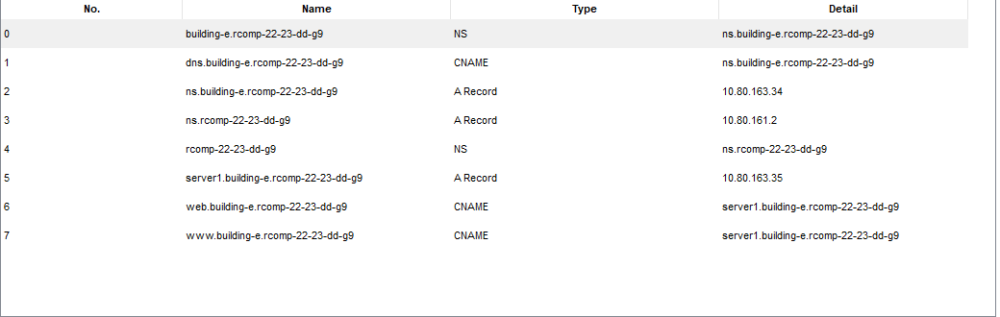

RCOMP 2022-2023 Project - Sprint 3 - Member 1181478 folder
==========================================================

# OSPF

All static routes (except the backbone default) were removed

## Building E OSPF
```bash
router ospf 5
 network 10.80.162.0 0.0.1.255 area 5 # Building E 
 network 10.80.167.0 0.0.0.127 area 0 # Backbone

```

# HTTP Server
**IP Address:** 10.80.163.35 / 27

## Home Page


# DHCP

## Requirements

1. Provide DHCP to all local networks within the building
2. DMZ has static addresses
3. Configuration for the VoIP VLAN must include **option 150**

## Configuration
### Excluded Addresses
```bash
# Default gateways for each VLAN
ip dhcp excluded-address 10.80.162.129  #floor 1
ip dhcp excluded-address 10.80.162.1    #wifi
ip dhcp excluded-address 10.80.163.33   #dmz
ip dhcp excluded-address 10.80.162.193  #floor 0
ip dhcp excluded-address 10.80.163.1    #VOIP  

# DMZ (including its default gateway)
ip dhcp excluded-address 10.80.163.33 10.80.163.63

Apesar de o dhcp excluir o default route, foi excluido os ips do default route para garantir que tal acontece.

```

### DHCP Pools

```bash
# Floor 1
ip dhcp pool f1
    network 10.80.162.128 255.255.255.192
    default-router 10.80.162.129
    dns-server 10.80.163.34
    domain-name building-e.rcomp-22-23-dd-g9 


# WiFi
ip dhcp pool wifi
    network 10.80.162.0 255.255.255.128
    default-router 10.80.162.1
    dns-server 10.80.163.34
    domain-name building-e.rcomp-22-23-dd-g9 

# Floor 0
ip dhcp pool f0
    network 10.80.162.192 255.255.255.192
    default-router 10.80.162.193
    dns-server 10.80.163.34
    domain-name building-e.rcomp-22-23-dd-g9  


# VoIP
ip dhcp pool voip
    network 10.80.163.0 255.255.255.224
    default-router 10.80.163.1
    dns-server 10.80.163.34
    domain-name building-e.rcomp-22-23-dd-g9 
    option 150 ip 10.80.163.1 # IP address of the TFTP server

```

# VoIP Service

**Phone prefix:** `5...`.

## Telephony service

```bash
telephony-service
    auto-reg-ephone
    max-ephones 25
    max-dn 25
    ip source-address 10.80.163.1 port 2000
    auto assign 1 to 25

ephone-dn 1
    number 5000

ephone-dn 2
    number 5001

```

```bash
ephone 1
 device-security-mode none
 mac-address 00D0.9735.17B4
 type 7960
 button 1:1
 
ephone 2
 device-security-mode none
 mac-address 0000.0C26.1398
 type 7960
 button 1:2

```
## Call Forwarding
```bash
dial-peer voice 1 voip
 destination-pattern 1...
 session target ipv4:10.80.167.2
 
dial-peer voice 2 voip
 destination-pattern 2...
 session target ipv4:10.80.167.3

dial-peer voice 3 voip
 destination-pattern 3...
 session target ipv4:10.80.167.4

dial-peer voice 4 voip
 destination-pattern 4...
 session target ipv4:10.80.167.5

```

# DNS service


**DNS Domain Name:** `rcomp-22-23-dd-g9`

DNS records:



# Address Translation (NAT)
## Interface configuration
```bash
# Building-E-facing interface
interface FastEthernet0/0
  no ip address
  ip nat inside
  duplex auto
  speed auto
  
interface FastEthernet1/0
  ip address 10.80.167.6 255.255.255.128
  ip nat outside
  
interface fastEthernet0/0.439
ip nat inside


```
## Redirection
<!-- FIXME: currently not working -->
```bash
# Redirect HTTP/HTTPS requests to our internal HTTPS server
ip nat inside source static tcp 10.80.163.35 80 10.80.167.6 80
ip nat inside source static tcp 10.80.163.35 443 10.80.167.6 443

# Redirect DNS requests to our internal DNS server
ip nat inside source static tcp 10.80.163.34 53 10.80.167.6 53
ip nat inside source static udp 10.80.163.34 53 10.80.167.6 53

```
# Static firewall (ACLs)
access-list 105 deny ip 10.80.162.0 0.0.0.255 any


## IPv4 Addressing

* The VTP Domain name to be used is **rc23ddg1**.

| **VLANIDs** | **VLAN Names** | **Necessary IPv4 Nodes** | **Network Prefix** |
|:-----------:|:--------------:|:------------------------:|:------------------:|
|     436     |      E_f0      |            45            |      **/26**       |
|     437     |      E_f1      |            60            |      **/26**       |
|     438     |     E_wifi     |            70            |      **/25**       |
|     439     |     E_dmz      |            20            |      **/27**       |
|     440     |     E_voip     |            25            |      **/27**       |


|                           | Router Sub-interface Addresses/Config |  Subnet Mask  | Network Address  |   Network Mask   | First Node Address(IPv4 Address) |  Broadcast Address  |  Usable Addresses  |  Required Addresses  |
|:-------------------------:|:-------------------------------------:|:-------------:|:----------------:|:----------------:|:--------------------------------:|:-------------------:|:------------------:|:--------------------:|
|       Wi-Fi Network       |          FastEthernet0/0.438          |      /25      |   10.80.162.0    | 255.255.255.128  |           10.80.162.1            |    10.80.162.127    |        126         |          70          |
|  1st Floor User Outlets   |          FastEthernet0/0.437          |      /26      |  10.80.162.128   | 255.255.255.192  |          10.80.162.129           |    10.80.162.191    |         62         |          60          |
| Ground Floor User Outlets |          FastEthernet0/0.436          |      /26      |  10.80.162.192   | 255.255.255.192  |          10.80.162.193           |    10.80.162.255    |         62         |          45          |
|           VoIP            |          FastEthernet0/0.440          |      /27      |   10.80.163.0    | 255.255.255.224  |           10.80.163.1            |    10.80.163.31     |         30         |          25          |
|       Building DMZ        |          FastEthernet0/0.439          |      /27      |   10.80.163.32   | 255.255.255.224  |           10.80.163.33           |    10.80.163.63     |         30         |          20          |
