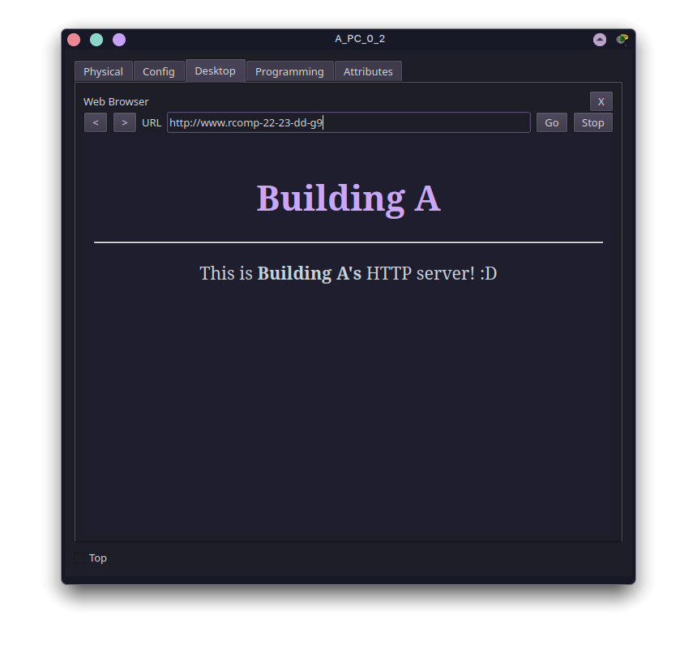

RCOMP 2022-2023 Project - Sprint 3 - Member 1210954 folder
==========================================================

# OSPF

All static routes (except the backbone default) were removed:
```bash
# Backbone router
no ip route 10.80.162.0 255.255.254.0 10.80.167.6
no ip route 10.80.164.0 255.255.255.0 10.80.167.3
no ip route 10.80.165.0 255.255.255.0 10.80.167.4
no ip route 10.80.166.0 255.255.255.0 10.80.167.5
no ip route 10.80.160.0 255.255.254.0 10.80.167.2

# Building A router
no ip route 0.0.0.0 0.0.0.0 10.80.167.1
```

## Backbone OSPF

```bash
router ospf 1
    network 10.80.167.0 0.0.0.127 area 0 # Backbone
    network 10.80.160.0 0.0.1.255 area 1 # Building A
    network 10.80.162.0 0.0.1.255 area 5 # Building E
    network 10.80.164.0 0.0.0.255 area 2 # Building B
    network 10.80.165.0 0.0.0.255 area 3 # Building C
    network 10.80.166.0 0.0.0.255 area 4 # Building D
    default-information originate
```

## Building A OSPF
```bash
router ospf 1
    network 10.80.160.0 0.0.1.255 area 1 # Building A
    network 10.80.167.0 0.0.0.127 area 0 # Backbone
```

# HTTP Server
**IP Address:** 10.80.161.3/25

## Home Page


# DHCP

## Requirements

1. Provide DHCP to all local networks within the building
2. DMZ has static addresses
3. Backbone has static addresses
4. Configuration for the VoIP VLAN must include **option 150**

## Configuration
### Excluded Addresses
```bash
# Default gateways for each VLAN
ip dhcp excluded-address 10.80.160.1
ip dhcp excluded-address 10.80.160.129
ip dhcp excluded-address 10.80.161.1
ip dhcp excluded-address 10.80.161.129
ip dhcp excluded-address 10.80.161.193

# DMZ (including its default gateway)
ip dhcp excluded-address 10.80.161.1 10.80.161.127
```

### DHCP Pools

```bash
# Floor 1
ip dhcp pool f1
    network 10.80.160.0 255.255.255.128
    default-router 10.80.160.1
    dns-server 10.80.161.2
    domain-name rcomp-22-23-dd-g9

# WiFi
ip dhcp pool wifi
    network 10.80.160.128 255.255.255.128
    default-router 10.80.160.129
    dns-server 10.80.161.2
    domain-name rcomp-22-23-dd-g9

# Floor 0
ip dhcp pool f0
    network 10.80.161.128 255.255.255.192
    default-router 10.80.161.129
    dns-server 10.80.161.2
    domain-name rcomp-22-23-dd-g9

# VoIP
ip dhcp pool voip
    network 10.80.161.192 255.255.255.192
    default-router 10.80.161.193
    dns-server 10.80.161.2
    domain-name rcomp-22-23-dd-g9
    option 150 ip 10.80.161.193 # IP address of the TFTP server
```

# VoIP Service

**Phone prefix:** `1...`.

## Telephony service

```bash
telephony-service
    auto-reg-ephone
    max-ephones 35
    max-dn 35
    ip source-address 10.80.161.193 port 2000
    auto assign 1 to 35

ephone-dn 1
    number 1000

ephone-dn 2
    number 1001
```
## Call Forwarding
```bash
dial-peer voice 2 voip
    destination-pattern 2...
    session target ipv4:10.80.167.3

dial-peer voice 3 voip
    destination-pattern 3...
    session target ipv4:10.80.167.4

dial-peer voice 4 voip
    destination-pattern 4...
    session target ipv4:10.80.167.5

dial-peer voice 5 voip
    destination-pattern 5...
    session target ipv4:10.80.167.6
```

# DNS service

**DNS Domain Name:** `rcomp-22-23-dd-g9`

DNS records:


# Address Translation (NAT)
## Interface configuration
```bash
# Building-A-facing interface
interface FastEthernet0/0
    no ip address
    ip nat inside

# Backbone-facing interface
interface FastEthernet1/0
    ip address 10.80.167.2 255.255.255.128
    ip nat outside
```
## Redirection
<!-- FIXME: currently not working -->
```bash
# Redirect HTTP/HTTPS requests to our internal HTTPS server
ip nat inside source static tcp 10.80.161.3 80 10.80.167.2 80
ip nat inside source static tcp 10.80.161.3 443 10.80.167.2 443

# Redirect DNS requests to our internal DNS server
ip nat inside source static tcp 10.80.161.2 53 10.80.167.2 53
ip nat inside source static udp 10.80.161.2 53 10.80.167.2 53
```
# Static firewall (ACLs)
<!-- TODO -->
