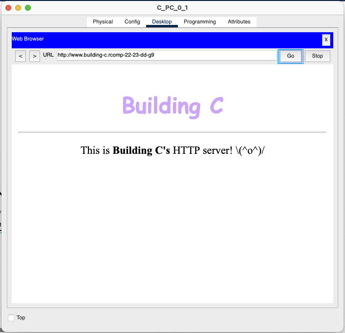
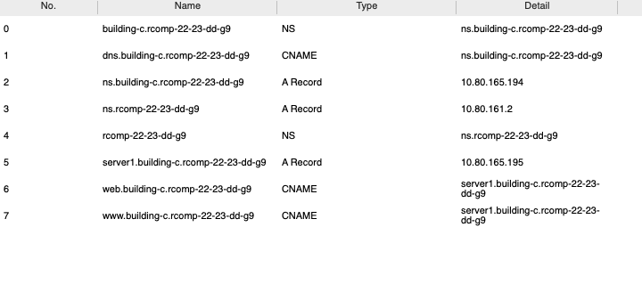

# RCOMP 2022-2023 Project - Sprint 3 - Member 1211155 folder

# OSPF

All static routes (except the backbone default) were removed

## Backbone OSPF

```bash
router ospf 1
    network 10.80.167.0 0.0.0.127 area 0 # Backbone
    network 10.80.160.0 0.0.1.255 area 1 # Building A
    network 10.80.162.0 0.0.1.255 area 5 # Building E
    network 10.80.164.0 0.0.0.255 area 2 # Building B
    network 10.80.165.0 0.0.0.255 area 3 # Building C
    network 10.80.166.0 0.0.0.255 area 4 # Building D
    default-information originate
```

## Building A OSPF

```bash
router ospf 3
 network 10.80.165.0 0.0.0.255 area 3 # Building C
 network 10.80.167.0 0.0.0.127 area 0 # Backbone
```

# HTTP Server

**IP Address:** 10.80.165.195/27

## Home Page



# DHCP

## Requirements

1. Provide DHCP to all local networks within the building
2. DMZ has static addresses
3. Configuration for the VoIP VLAN must include **option 150**

## Configuration

### Excluded Addresses

```bash
# Default gateways for each VLAN
ip dhcp excluded-address 10.80.165.1
ip dhcp excluded-address 10.80.165.65
ip dhcp excluded-address 10.80.165.129
ip dhcp excluded-address 10.80.165.193
ip dhcp excluded-address 10.80.165.225

# DMZ (including its default gateway)
ip dhcp excluded-address 10.80.165.193 10.80.165.223
```

### DHCP Pools

```bash
# Floor 0
ip dhcp pool f0
 network 10.80.165.0 255.255.255.192
 default-router 10.80.165.1
 dns-server 10.80.165.194
 domain-name building-c.rcomp-22-23-dd-g9
# Floor 1
ip dhcp pool f1
 network 10.80.165.64 255.255.255.192
 default-router 10.80.165.65
 dns-server 10.80.165.194
 domain-name building-c.rcomp-22-23-dd-g9
# Wifi
ip dhcp pool wifi
 network 10.80.165.128 255.255.255.192
 default-router 10.80.165.129
 dns-server 10.80.165.194
 domain-name building-c.rcomp-22-23-dd-g9
# VoIP
ip dhcp pool voip
 network 10.80.165.224 255.255.255.224
 default-router 10.80.165.225
 option 150 ip 10.80.165.225
 dns-server 10.80.165.194
 domain-name building-c.rcomp-22-23-dd-g9
```

# VoIP Service

**Phone prefix:** `3...`.

## Telephony service

```bash
telephony-service
 max-ephones 25
 max-dn 25
 ip source-address 10.80.165.225 port 2000
 auto assign 1 to 25

ephone-dn 1
 number 3001

ephone-dn 2
 number 3002
```

## Call Forwarding

```bash
dial-peer voice 1 voip
 destination-pattern 1...
 session target ipv4:10.80.167.2

dial-peer voice 2 voip
 destination-pattern 2...
 session target ipv4:10.80.167.3

dial-peer voice 3 voip
 destination-pattern 3...
 session target ipv4:10.80.167.4

dial-peer voice 4 voip
 destination-pattern 4...
 session target ipv4:10.80.167.5

dial-peer voice 5 voip
 destination-pattern 5...
 session target ipv4:10.80.167.6
```

# DNS service

**DNS Domain Name:** `rcomp-22-23-dd-g9`

DNS records:



# Network Address Translation (NAT)

## Interface configuration

```bash
# Building-A-facing (sub)interfaces
interface FastEthernet0/0.429
 encapsulation dot1Q 429
 ip address 10.80.165.193 255.255.255.224
 ip nat inside

interface FastEthernet1/0
 ip address 10.80.167.4 255.255.255.128
 ip access-group 131 in
 ip nat outside
```

## Redirection

```bash
# Redirect HTTP/HTTPS requests to our internal HTTPS server
ip nat inside source static tcp 10.80.165.195 443 10.80.167.4 443
ip nat inside source static tcp 10.80.165.195 80 10.80.167.4 80

# Redirect DNS requests to our internal DNS server
ip nat inside source static tcp 10.80.165.194 53 10.80.167.4 53
ip nat inside source static udp 10.80.165.194 53 10.80.167.4 53
```

# Static firewall (ACLs)

## Backbone router

```bash
# internal spoofing
access-list 100 permit ip 10.80.160.0 0.0.7.255 any

# external spoofing
access-list 101 deny   ip 10.80.160.0 0.0.7.255 any
# allow all but the ones from external spoofing
access-list 101 permit ip any any
```

## Building A router

### Fa 0/0's sub-interfaces (inwards-facing)

```bash
# internal spoofing
access-list 130 permit ip 10.80.165.0 0.0.0.255 any

# allow outgoing ICMP echo requests/replies
access-list 130 permit icmp 10.80.165.0 0.0.0.255 any echo-reply
access-list 130 permit icmp 10.80.165.0 0.0.0.255 any echo

# permit outgoing traffic from DMZ if from DNS or HTTP/HTTPS services
access-list 130 permit tcp host 10.80.165.195 eq www any established
access-list 130 permit tcp host 10.80.165.195 eq 443 any established
access-list 130 permit udp host 10.80.165.194 eq domain any

# TFTP traffic for VoIP phones
access-list 130 permit udp 10.80.165.224 0.0.0.31 eq tftp any eq tftp
```

### Interface Fa 1/0 (outwards-facing)

```bash
# external spoofing
access-list 131 deny ip 10.80.165.0 0.0.0.255 any

# permit incoming ICMP echo requests/replies
access-list 131 permit icmp any 10.80.165.0 0.0.0.255 echo
access-list 131 permit icmp any 10.80.165.0 0.0.0.255 echo-reply

# Allow traffic to DNS/HTTP services (via NAT)
access-list 131 permit tcp any host 10.80.167.4 eq www
access-list 131 permit tcp any host 10.80.167.4 eq 443
access-list 131 permit udp any host 10.80.167.4 eq domain

# Block all traffic to the DMZ
access-list 131 deny ip any 10.80.165.192 0.0.0.31

# TFTP and dial-peer
access-list 131 permit udp any eq tftp host 10.80.167.4 eq tftp
access-list 131 permit tcp any host 10.80.167.4 eq 1720
access-list 131 permit tcp any host 10.80.167.4 established

# OSPF traffic
access-list 131 permit ospf any any

# Deny all other traffic directed to the router
access-list 131 deny ip any host 10.80.167.4

# DHCP traffic
access-list 131 permit ip host 0.0.0.0 host 255.255.255.255

# Remaining traffic should be allowed
access-list 131 permit ip any any
```
